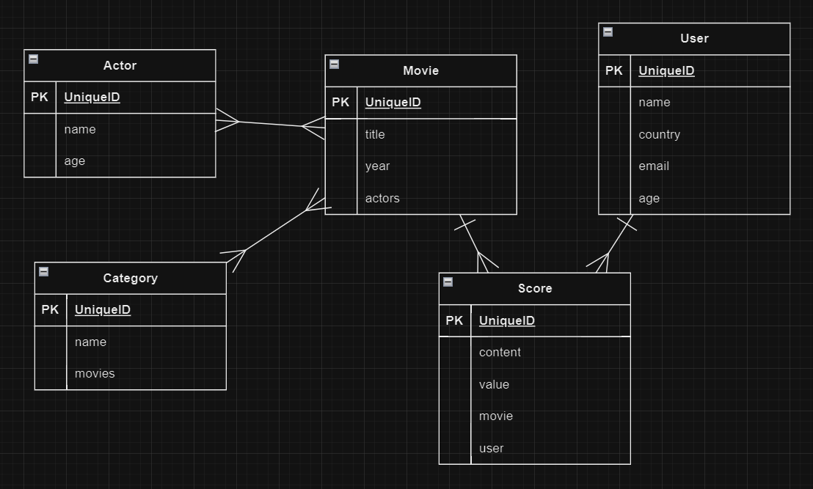

# SQL-ORM

## 프로젝트 구성 & 모델링
- startproject
- startapp & INSTALLED_APPS

- movies/models.py 수정 modeling
- makemigrations, migrate

## dummy data 생성을 위한 custom command
- 폴더, 파일 생성
```movies/
    __init__.py
    models.py
    management/
        __init__.py
        commands/
            __init__.py
            generate.py
    tests.py
    views.py
```
- `python manage.py generate`

## ORM
- django 기본 쉘기능 업그레이드를 위한 라이브러리 설치
- `pip install django-extensions`
- `python manage.py shell`

## SQL
- VSCode 확장프로그램 SQLite 설치
- *.sql 파일 작성
- 우클릭 > Run Query